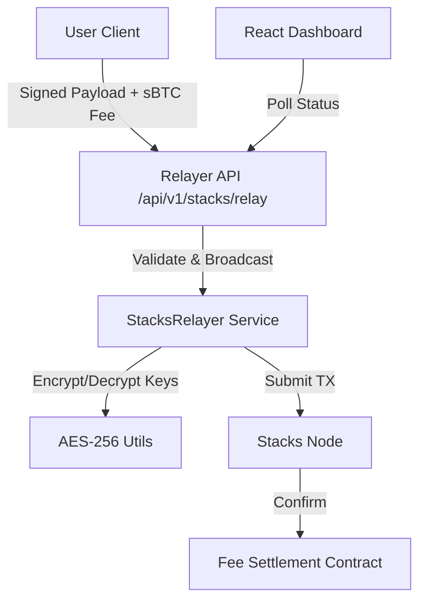

# 🚀 Stacks Gasless Relayer
> **The ultimate bridge to gasless sBTC transactions on Stacks.**

[](https://www.gnu.org/licenses/agpl-3.0)
[](https://www.rust-lang.org/)
[](https://www.stacks.co/)
[](https://vitejs.dev/)

**Stacks Gasless Relayer** supercharges the OpenZeppelin Relayer architecture with native **Stacks** support, enabling users to pay transaction fees in **sBTC** instead of STX. Secure, fast, and built for the Bitcoin economy.

---

## 📖 Origin Story

This project is a specialized fork of the robust [OpenZeppelin Relayer](https://github.com/OpenZeppelin/openzeppelin-relayer). While the original project provides a solid foundation for multi-chain support (EVM, Solana, Stellar), this fork allows for **Stacks-native capabilities**.

We've retained the battle-tested architecture—Actix-web server, secure key management, and repository patterns—while injecting Stacks-specific logic to bridge the gap between Bitcoin-layer assets and gasless user experiences.

---

## ✨ Features

- **🔥 sBTC Gas Payment**: Users pay fees in sBTC; Relayer covers the STX gas.
- **🛡️ AES-256 Security**: Military-grade encryption for private key storage.
- **⚡ Rust Backend**: High-performance Actix-web service based on OpenZeppelin's relayer.
- **📊 Interactive Dashboard**: Real-time monitoring of relayers and transactions (Vite + React).
- **📝 Clarity Contracts**: Custom fee settlement logic on the Stacks blockchain.
- **🔌 Multi-Chain Ready**: Inherits support for Solana, EVM, and Stellar.

---

## 🏗 Architecture



## 🚀 Quick Start

### Prerequisites
- [Rust](https://rustup.rs/) (latest stable)
- [Node.js](https://nodejs.org/) (v20+) & npm
- [Docker](https://www.docker.com/) (Recommended)

### 1. Backend Setup

#### 🐳 Using Docker (Recommended)
The easiest way to run the relayer is with Docker Compose, which sets up the Relayer service and the required Redis database automatically.

```bash
docker-compose up --build
```
The API will be available at `http://localhost:8080/api/v1`.

#### 🛠️ Manual Setup
If you prefer to run manually, ensure you have **Redis** running locally.

```bash
# Set up environment variables
cp .env.example .env 2>/dev/null || true
export API_KEY=$(uuidgen)
export STORAGE_ENCRYPTION_KEY=$(openssl rand -base64 32)
export STACKS_NODE_URL="https://stacks-node-api.testnet.stacks.co"
export REDIS_URL="redis://localhost:6379"

# Run the backend
cargo run
```

### 2. Frontend Dashboard
Launch the monitoring dashboard:

```bash
cd frontend
npm install
npm run dev
```
Visit `http://localhost:5173` to see your relayer in action! 🎨

---

## 🛠 API Reference

### Relay Transaction
`POST /api/v1/stacks/relay`

**Body:**
```json
{
  "tx_hex": "800000..."
}
```

**Response:**
```json
{
  "status": "success",
  "tx_id": "0x..."
}
```

---

## 🔐 Security

We take security seriously. Since this project manages private keys and handles transactions, we've implemented multiple layers of protection:

- **Inherited Security**: Built on top of the OpenZeppelin Relayer, benefiting from their rigorous auditing and security practices.
- **AES-256 Encryption**: All sensitive keys are encrypted at rest using AES-256-GCM. We use a dedicated `STORAGE_ENCRYPTION_KEY` to ensure your keys are never stored in plain text.
- **Strict Validation**: Every transaction payload undergoes rigorous validation checks before being broadcast to the network.
- **Policy Engine**: Inherited OpenZeppelin policy engine allows you to define granular transaction approval rules (e.g., max gas price, whitelist addresses).

---

## 🤝 Contributing

Got a cool idea? We'd love to hear it!

1.  Fork the repo 🍴
2.  Create your feature branch (`git checkout -b feature/amazing-feature`)
3.  Commit your changes (`git commit -m 'Add some amazing feature'`)
4.  Push to the branch (`git push origin feature/amazing-feature`)
5.  Open a Pull Request 🚀

---

## 📜 License

This project is licensed under the AGPL v3 License - see the [LICENSE](LICENSE) file for details.

---

<p align="center">
  Built with ❤️ by the Stacks Community & OpenZeppelin
</p>
